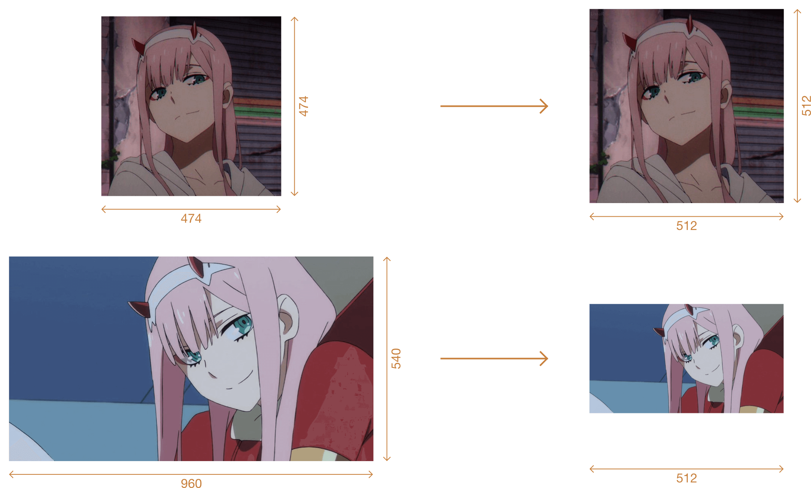

This bash script uses ImageMagick's `convert` to help creating thumbnails, it was born to create sticker images for Telegram.

The default values are `512x512` for the size and `./thumb` as the destination directory, but can be changed with the `-d` and `-s` options respectively. If the image doesn't have the right rateo for the size, it's embedded in a bigger rectangle with a transparent background.

### Example
I'm converting two images, the first one is a 474x474 square jpg, the second one is 960x540 rectangle png. The result in both case is a 512x512 square, the originals can be found in the `example` folder.

